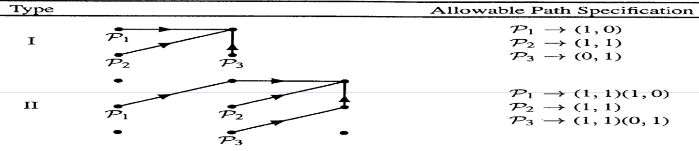

# word-recognition-DTW
This is a minimal code part of my assignment for the graduate course Speech Recognition. The code is pretty simple and it can be a good starting point for using  Dynamic Time Warping algorithm.

## How it works
 - preprocessing
 
   We instanciate the basic processors for framing, applying STFT and extracting the Mel-Frequency-Cepstral-Coefficients from the audio files.
   
 - preparing training samples
 
   Since we have 3 audio files for each word in each directory, we take the first directory as training data. For each word we take one of the files as source and find the optimal alignment between the source and the other two files. Having the alignments we take average on similar frames (in other words, for each frame in the source sample there are one or more frames aligned with in the other samples. we average over all these frames aligned with the source sample frame). The final sequence of frames for each word is our train sample for that word.
   
 - prediction
 
   Now that we have a training sample for each word, we calculate the minimum distance between each of the test samples and the training samples and we label the test sample with the lable corresponding to the training sample closest to it. The minimum distance is the accumulated distance calculated with DTW.

## Notes
 - Two types of local constraints are implemented in this project. (type I and II as shown below)
 
 
 
 - You can enable/disable weighting in the DTW  (it may change the results)
 - Speech features included in this project are: spectrogram, mfcc, lpc, plp
